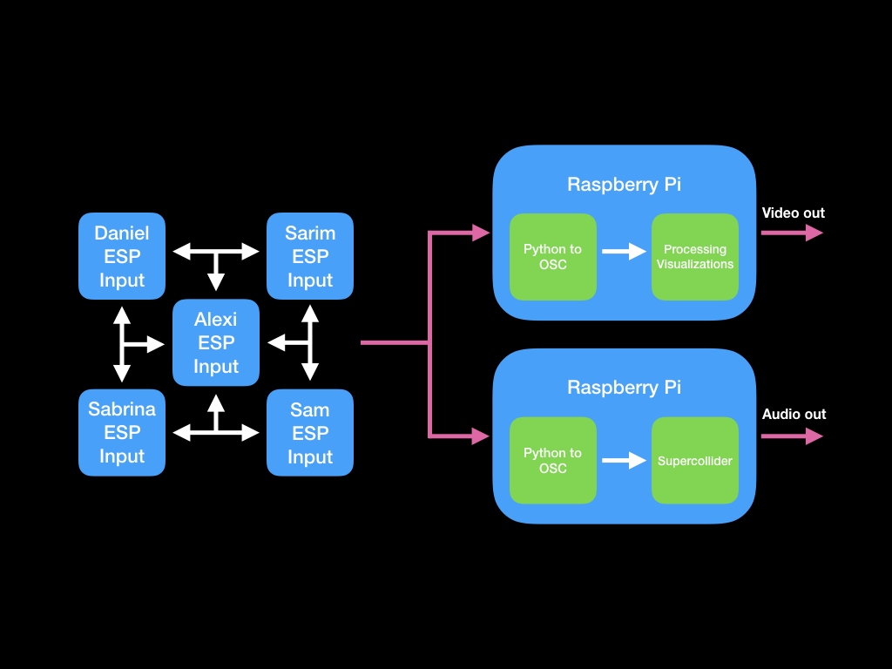

# AKW Takeover

A group project for Yale CPSC 334 (Creative Embedded Systems)
Team members: Sarim Abbas, Daniel Kaylor, Alexi Christakis, Sam Lopate, Sabrina Long

### Task 1 Documentation

We are using a mesh network to connect our 5 ESP32 boards to each other and to two Raspberry Pis that will be used for actualization. We will be placing our sensors on the 2nd floor atrium and the 3rd floor Zoo of AKW as follows: one in the Closed Zoo, one in the Open Zoo, one in the kitchenette area, one by the blackboards near the central stairs to the third floor, and one in the classroom on the far end of the floor. One of our Raspberry Pis will be projecting a display onto a wall from the third floor so that the display will be visible from the atrium.

We are using painlessmesh and painlessmeshboost on the ESP32s and Pis to connect to the mesh network, respectively. The sensors will be sending data in JSON format to the projecting Pi, which will load the data into a log file in the format of "tag-val1-val2..." for however many values there are. The "tag" part of the message will be used to identify from which sensor the data came.

- [Sarim's Volcano Input documentation](./mesh/sarim-earth-input/)
- [Alexi's Earthquake Input documentation](./mesh/alexi-input/)

### Task 2 Documentation

#### Sarim's visualization

Demo video on YouTube: <https://www.youtube.com/watch?v=5bXN0hbBsPI>

The mesh input data is visualized as concentric circles, one drawn for each data point. The circles are colored according to their source elements, i.e. air, water, earth, fire and lava. A new gradient background (computed from two randomized elements) is also set every 10 frames, which lets the visualization start anew. The proportion of each element's circles corresponds roughly to the respective inputs' usage by passerby.

#### Alexi's visualization

My concept for this visualization was to encourage the occupants of AKW to arbitrarily divide themselves into teams corresponding with each device in our network. To accomplish the encouragement aspect, my visualization is a form of a leaderboard, where the stimulation of each sensor accumulates over time. The summations are displayed in a piechart so that members of each team can track their progress and compete to increase their value the fastest.
