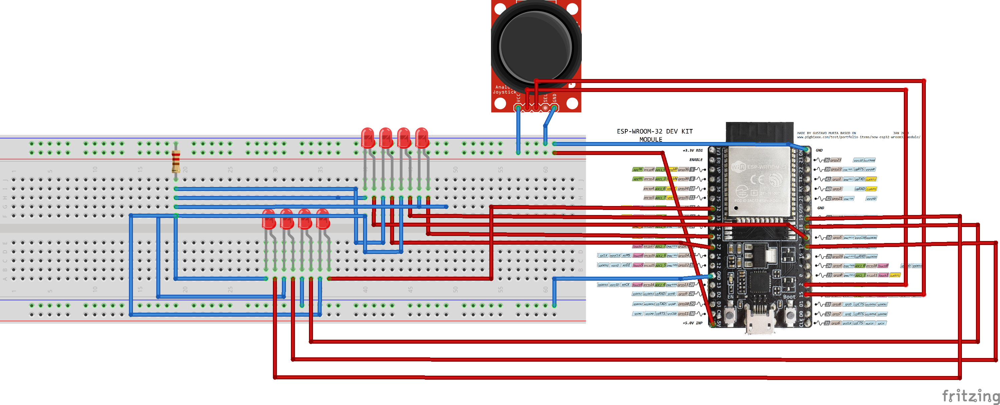

# Earth input

- [Earth input](#earth-input)
  - [Video demo](#video-demo)
  - [Design decisions](#design-decisions)
    - [LED ring](#led-ring)
    - [Enclosure](#enclosure)
    - [Activation algorithm](#activation-algorithm)
  - [Schematic](#schematic)
  - [Technical challenges](#technical-challenges)
    - [Pins for LED output](#pins-for-led-output)
    - [Underpowered ESP](#underpowered-esp)
    - [Conflicts with PainlessMesh](#conflicts-with-painlessmesh)
    - [Reducing the amount of wire needed](#reducing-the-amount-of-wire-needed)

I decided to adopt the earth element, more specifically lava.

I had an idea that I wanted the viewer to interact using a joystick. After a number of iterations, I decided on making the viewer rotate the joystick 360 degrees to activate an LED ring.

## Video demo

On YouTube at: <https://www.youtube.com/watch?v=M_mOXDXI0_c>

## Design decisions

### LED ring

Given the imprecision of the joystick, I decided to create a ring with only 8 LEDs. Although fewer LEDs, they can be distributed further apart and still allow the user to feel circular motion as the LEDs activate sequentially.

The 8 LEDs were encased in a 3D-printed enclosure. Each LED shares a ground and has independent GPI wiring.

### Enclosure

After trying origami and PVC solutions, I eventually settled on creating my enclosure from cardboard, in the shape of a volcano.

The enclosure is hollow, which has the benefit of having enough space for all the electronics, including the ESP32 and the power source.

The volcano was painted using acrylic paint.

### Activation algorithm

The user rotates the joystick to the four poles of the ring, activating each LED. An activation threshold prevents immediate activation, and gives a satisfying feeling of resistance.

Once the four poles are activated, the completion animation sequence starts. The LEDs start blinking in order, starting with the north pole. The animation accelerates linearly with time, until at one point it is fast enough to "eat itself". The effect is achieved with tweaking delays.

When the animation is complete, the activation message is sent over the mesh network.

## Schematic

## Technical challenges

### Pins for LED output

Not all pins were suitable. Those that were used successfully:

- Left track
  - GPIO32
  - GPIO33
  - GPIO26
  - GPIO27
- Right track
  - GPIO19
  - GPIO18
  - GPIO5
  - GPIO17

### Underpowered ESP

With the joystick attached to 5V and GND, along with the 8 LEDs, the ESP32 would not flash, with an invalid packet header error. This was resolved by unplugging the joystick from power whenever the flash was in progress.

### Conflicts with PainlessMesh

The PainlessMesh library does not play nicely with delays in sensor code. My sensor relies a lot on delays in order to play the LED ring animation. In fact, any library that uses delays (e.g. AxisJoystick for denoising) fails when using PainlessMesh. So it was not possible for me to run a mesh node on my ESP, short of actually reverse-engineering the mesh protocol to send messages. To solve this, I partnered with Daniel's input, setting up GPIO communication and piggybacking off his node. Not only does this take advantage of the versatility of the mesh, but also plays well thematically, since our inputs (earth and air) are now physically close together. 

### Reducing the amount of wire needed

Instead of eight 5V/GND pairs of wire, with 8 resistors, I simplified the circuit greatly by making the 8 LEDs share a ground and a single resistor. The challenge was getting all the cathodes together, which was done with a lot of solder.
